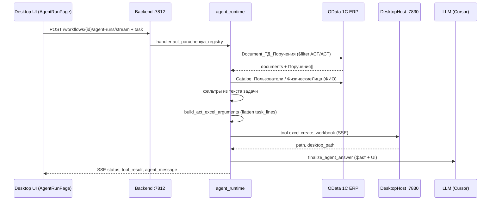

# Регламент: ACT-реестр поручений (ИИ-агент)

**Версия:** 2026-08-19 · **Handler:** `act_porucheniya_registry`  
**Живой документ** — дополняем по мере выполнения задач. Не прячем: лежит в корне репо [`ACT_REGISTRY.md`](ACT_REGISTRY.md).

---

## 1. Назначение

Локальный **ACT-реестр** — Excel на рабочем столе, где **каждая строка = одна задача** из табличной части «Поручения» документа 1С `Document_ТД_Поручения` (номера ACT/АСТ00-***).

Дополняет Action Tracker в 1С: удобные сводки, фильтры, отчётность для ПСД/PMO без ручного копирования из журнала.

**Пример результата** (один ACT — несколько строк):

```
ACT00-00069 | Разработать проекты регламентов… | Тищенко Марина Николаевна | 31.07.2026 | Принято
ACT00-00069 | Представить ПСД проекты регламентов… | Тищенко Марина Николаевна | 31.07.2026 | Принято
ACT00-00069 | Доклад по поручению на заседании РК | Тищенко Марина Николаевна | 04.08.2026 | Принято
```

---

## 2. Формат Excel

| Параметр | Значение |
|----------|----------|
| Имя файла | `act_porucheniya_{инициалы}_{workflow_id[:8]}.xlsx` |
| Расположение | Рабочий стол Windows (`save_to_desktop: true`) |
| Лист | `Задачи ACT` |
| Строк данных | Одна строка на каждую задачу (не на документ) |

**Колонки:**

| № | Колонка | Источник OData |
|---|---------|----------------|
| 1 | Номер ACT | `Number` → нормализация АСТ→ACT |
| 2 | Задача | ТЧ `Поручения.Мероприятие` |
| 3 | Исполнитель | ТЧ `Поручения.ОтветственноеЛицо_Key` → `Catalog_Пользователи` → `Catalog_ФизическиеЛица` |
| 4 | Срок | ТЧ `Поручения.СрокИсполнения` |
| 5 | Статус | `Статус` документа 1С: **В работе**, **Принято**, **Создано**, **Отменено** (как в журнале) |

**Цвет строки (заметная пастель, ARGB в `row_fills`):**

| Условие | Цвет |
|---------|------|
| Документ «Принято» | зелёный `FF81C784` |
| Просрочено | красный `FFFFCDD2` |
| ≤3 дня | коралловый `FFFFAB91` |
| 4–7 дней | оранжевый `FFFFCC80` |
| 8–14 дней | жёлтый `FFFFF176` |
| >14 дней | зелёный `FFA5D6A7` |

Сетка: тонкие границы ячеек (`cell_borders`), перенос в колонке «Задача».

---

## 3. Архитектура и поток выполнения



**Ключевое:** OData читает backend (Docker). Excel пишет **DesktopHost** на ПК пользователя — без него файл не появится.

---

## 4. Маршрут агента (agent_route)

```json
{
  "handler": "act_porucheniya_registry",
  "kind": "act_porucheniya",
  "default_task": "Выгрузи реестр поручений ACT (Document_ТД_Поручения) из 1С через OData и сохрани Excel на рабочий стол…",
  "tools": ["onec.act_porucheniya_registry", "act_protocol_merge", "excel.create_workbook"]
}
```

Источник правды: [`backend/app/services/agent_route.py`](backend/app/services/agent_route.py)  
Спецификация/seed: [`backend/app/services/act_registry_agent_spec.py`](backend/app/services/act_registry_agent_spec.py)

---

## 5. Tools (инструменты)

| Tool | Где выполняется | Назначение |
|------|-----------------|------------|
| `onec.act_porucheniya_registry` | Backend (Python) | Не отдельный HTTP-tool — **внутренний шаг** runtime: OData + нормализация + ФИО исполнителей |
| `excel.create_workbook` | DesktopHost :7830 | Создание `.xlsx` с headers, rows, row_fills, save_to_desktop |

Реализация Excel: [`desktop/app/tools/ac/excel_tools.py`](desktop/app/tools/ac/excel_tools.py) → `ExcelCreateWorkbookTool`

**Не используем для ACT-реестра:**

- `onec.com.*` — COM/запросы 1С (другой сценарий: `ТД_ЗадачиПротоколов`)
- `assignments_smart` / personal `porucheniya_*.xlsx`

---

## 6. OData 1С

| Параметр | Значение |
|----------|----------|
| Сущность | `Document_ТД_Поручения` |
| Фильтр | `DeletionMark eq false`, `startswith(Number,'АСТ')` |
| Expand | `КтоДоложитОЗавершенииМероприятий`, `СекретарьРК` |
| Табличная часть | `Поручения[]` — приходит в теле документа |

**Поля строки «Поручения»:**

- `Мероприятие` — текст задачи  
- `ОтветственноеЛицо_Key` — GUID → ФИО  
- `СрокИсполнения` — срок задачи  
- `LineNumber`, `Приоритет`

**Не опубликовано в OData (404):** `InformationRegister_ТД_ЗадачиПротоколов`, `ТД_ЗадачиОтдела` — для них COM, не этот агент.

Код: [`backend/app/services/act_porucheniya_odata.py`](backend/app/services/act_porucheniya_odata.py)

---

## 7. Логика backend (модули)

| Модуль | Роль |
|--------|------|
| `agent_runtime._run_act_porucheniya_registry` | Оркестрация: OData → фильтр → Excel → LLM |
| `act_porucheniya_odata.fetch_act_porucheniya_registry` | Загрузка документов + `resolve_task_line_executors` |
| `act_porucheniya_report.flatten_documents_to_task_rows` | 1 документ × N задач → N плоских строк |
| `act_porucheniya_report.build_act_excel_arguments` | Аргументы для `excel.create_workbook` |
| `act_porucheniya_report.compose_act_registry_answer` | Технический отчёт для чата |
| `act_porucheniya_task.parse_act_filter_from_task` | Фильтры из текста пользователя |
| `agent_llm_reply.finalize_agent_answer` | Итоговый ответ LLM с границами UI |

---

## 8. Чат пользователя (фильтры и примеры)

Пользователь пишет в **AgentRunPage** или жмёт «Запустить типовую задачу».

| Запрос | Поведение |
|--------|-----------|
| «Выгрузи полный ACT-реестр» | Все ACT, все задачи → Excel |
| «Только просроченные» | Фильтр по сроку **задачи** |
| «ACT00-00069» | Только этот номер |
| «Покажи задачи ACT00-00088» | Фильтр + Excel + ответ построчно |
| «Без Excel, только сводка» | `refresh_excel: false` |

Формат ответа в чате (как для АСТ00-00069):

```
ACT00-00069 (Принято) — О разработке проектов регламентов…
1. Разработать проекты…
   Исполнитель: …
   Срок: 31.07.2026
```

---

## 9. Окружение и запуск

**Переменные** (`infra/.env`):

- `ODATA_BASE_URL`, `ERP_LOGIN`, `ERP_PASSWORD` — OData  
- `CURSOR_API_KEY`, `LLM_PROVIDER=cursor` — ответ в чате  
- `AUTH_SERVER_URL` — вход через общий сервер; backend локально `127.0.0.1:7812`

**Скрипты:**

| Скрипт | Назначение |
|--------|------------|
| `scripts/seed_act_registry_agent.py` | Установить/обновить агента в локальном backend |
| `scripts/regenerate_act_excel_desktop.py` | Excel на Desktop без UI (обход старого Docker) |
| `scripts/lookup_act_tasks.py` | Задачи одного ACT, напр. `АСТ00-00069` |
| `scripts/run_act_porucheniya_agent_desktop.py` | E2E через API + stream |

**Пересборка backend после изменений кода:**

```powershell
docker compose -f infra/docker-compose.yml up -d --build constructor-gateway
```

**Desktop:** рядом с `ConstructorDesktop.exe` должен быть `DesktopHost.exe` (порт 7830).

---

## 10. Дополнение из протокола совещания

Если в задаче есть **дополни / протокол / новый ACT** или блок `--- ПРОТОКОЛ ---`:

```
ACT00-00089 — «Название»
  1. Текст задачи
     Исполнитель: ФИО
     Срок: 30.09.2026
  Статус: В работе
```

**Логика** — [`act_protocol_merge.py`](backend/app/services/act_protocol_merge.py):

1. Разбор протокола → документы с `task_lines`  
2. Слияние с OData (новые ACT + строки без дубликатов)  
3. **Цвет строки** — по сроку задачи (та же шкала критичности, что и для OData)  
4. **Отличие от OData** — колонка «Статус»: «Из протокола» или статус из текста протокола; номер ACT может быть `ACT00-PROTO-*` для свободной формы  

```powershell
py -3.12 scripts/regenerate_act_excel_desktop.py 7e81ded8 --protocol logs/protocol_rk_47_2026-08-19.txt
```

---

## 11. Вне scope (пока)

- Запись/изменение поручений в 1С  
- Точечная правка ячеек Excel из чата (только полная перегенерация файла)  
- OData регистров `ТД_ЗадачиПротоколов`  
- SMART-проверка (отдельный агент)

---

## 12. TODO — дописываем по ходу

- [x] Дополнение Excel из протокола (статус «Из протокола», цвет по сроку)  
- [ ] Синхронизация агента на общий сервер `192.168.1.157`  
- [ ] Колонка «Приоритет» задачи  
- [ ] Фильтр по исполнителю из чата  
- [ ] Второй лист «Сводка по исполнителям»  
- [ ] Еженедельный отчёт PMO  
- [ ] Привязка вложений workflow к ACT  

---

## 13. Связанные документы

- [AGENT_BUILDER.md](AGENT_BUILDER.md) — карта платформы  
- [AGENT_INTERACTION.md](AGENT_INTERACTION.md) — граница агент / tools  
- `logs/psd_regulation_text.txt` — исходный регламент ПСД (Action Tracker)
