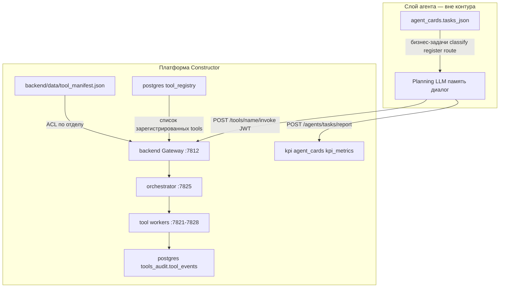

# Руководство для агента-разработчика (Constructor Platform)

**Начните отсюда**, если вы — внешний ИИ-агент или разработчик, который создаёт других агентов и должен понять, **где что лежит** и **откуда берётся каждая часть системы**.

---

## 1. Карта документации (что читать и зачем)

| Документ | Для кого | Содержание |
|----------|----------|------------|
| **[AGENT_BUILDER.md](AGENT_BUILDER.md)** *(этот файл)* | Агент-разработчик | Карта репо, источники правды, каталог tools, API, запуск |
| [AGENT_INTERACTION.md](AGENT_INTERACTION.md) | Внешний рабочий агент | Граница ответственности: задачи агента ≠ tools ≠ KPI |
| [PLATFORM.md](PLATFORM.md) | DevOps / интегратор | Docker, порты, скрипты, mock-сценарии, тесты |
| [ARCHITECTURE.md](ARCHITECTURE.md) | Архитектор | Целевая схема Gateway → Runtime → RabbitMQ → workers |
| [README.md](README.md) | Общий обзор | MVP desktop + backend, краткий каталог tools |
| [backend/README.md](backend/README.md) | Backend-разработчик | Auth 1С, JWT, health, LLM stub |

**Demo UI** (ручная проверка sandbox) — **вне репозитория**: `../platform-demo-ui/` (рядом с `Consturctor/`), URL http://127.0.0.1:8790/

---

## 2. Карта репозитория (где что лежит)

```
Consturctor/
├── backend/                          # Gateway :7812 — единая точка входа для агента
│   ├── app/api/v1/tools.py           # GET /tools, POST /tools/{name}/invoke, ACL
│   ├── app/config.py                 # URL orchestrator, tool_*_url, manifest
│   └── data/tool_manifest.json       # ACL: какие tools разрешены по умолчанию
│
├── services/
│   ├── platform-orchestrator/        # Agent Runtime :7825
│   │   └── platform_orchestrator/
│   │       ├── service.py            # Маршрутизация tool → URL/очередь
│   │       ├── tool_sandbox.py       # Готовые цепочки для проверки tools
│   │       └── agent_mocks.py        # Mock-сценарии агента (не бизнес-задачи)
│   │
│   ├── platform-tool-imap/           # :7821  imap.*
│   ├── platform-tool-onec/           # :7822  onec.*
│   ├── platform-tool-shell/          # :7823 sandbox, :7828 native (native_main.py)
│   ├── platform-tool-browser/        # :7824  browser.*
│   ├── platform-tool-com/            # :7826  com.*     (Windows host)
│   ├── platform-tool-filesystem/     # :7827  fs.*      (Windows host)
│   └── platform-kpi/                 # :7820  KPI
│
├── platform-contracts/               # Общие Pydantic-схемы (ToolInvokeRequest, ToolResult)
├── platform-service-common/            # create_tool_app() — factory для всех tool-сервисов
├── platform-db/                        # SQLAlchemy, audit tool_events
│
├── infra/
│   ├── docker-compose.yml            # Весь Docker-стек + env TOOL_*_URL
│   ├── .env.example                  # Шаблон переменных (IMAP, OData, desktop tools)
│   └── postgres/init/
│       ├── 01-schemas.sql            # tool_registry — seed всех tools в БД
│       └── 02-agent-cards.sql        # agent_cards, task_reports (задачи агента)
│
├── scripts/
│   ├── docker_up.cmd                 # Поднять Docker stack
│   ├── start_desktop_tools.cmd       # COM + FS + native shell на Windows
│   └── start_platform_all.cmd        # Docker + desktop tools
│
├── tests/                            # pytest — контракты, stub tools, sandbox
└── desktop/                          # PySide6 UI (MVP, не tool API)
```

---

## 3. Что из чего исходит (источники правды)



### Три независимых слоя (не путать)

| Слой | Источник правды | Файл / таблица | Кто решает |
|------|-----------------|----------------|------------|
| **Задачи агента** | Карточка агента | `agent_cards.tasks_json` → [02-agent-cards.sql](infra/postgres/init/02-agent-cards.sql) | Разработчик агента |
| **Инструменты (tools)** | Реестр платформы | [01-schemas.sql](infra/postgres/init/01-schemas.sql) + [tool_manifest.json](backend/data/tool_manifest.json) | Платформа |
| **KPI** | Метрики карточки | `agent_cards.kpi_metrics_json` + `agent_task_reports` | Платформа считает, агент отчитывается |

**Важно:** платформа **не** связывает «задачу `classify_incoming`» с «tool `imap.search`». Агент сам выбирает tools при выполнении своих задач.

### Цепочка вызова tool (от API до кода)

```
1. Агент:  POST /api/v1/tools/imap.search/invoke  + JWT
2. Gateway: backend/app/api/v1/tools.py
            → проверка ACL (tool_manifest.json)
            → proxy в orchestrator
3. Runtime: services/platform-orchestrator/.../service.py
            → _tool_url("imap.search") → http://platform-tool-imap:7821
            → (или Celery queue imap/onec для async)
4. Worker:  services/platform-tool-imap/platform_tool_imap/main.py
            → REAL_HANDLERS["imap.search"] или STUB_HANDLERS (если USE_STUBS=true)
5. Ответ:  ToolResult { ok, data, error, audit_id }
            → audit в tools_audit.tool_events
```

---

## 4. Каталог рабочих инструментов

### 4.1. Сводная таблица

| Tool | Назначение | Где выполняется | Порт | Код handler |
|------|------------|-----------------|------|-------------|
| `imap.list_unread` | Непрочитанные UID | Docker | 7821 | [imap/main.py](services/platform-tool-imap/platform_tool_imap/main.py) |
| `imap.fetch_message` | Тело письма | Docker | 7821 | ↑ |
| `imap.fetch_attachments` | Вложения | Docker | 7821 | ↑ |
| `imap.search` | Поиск по ящику | Docker | 7821 | ↑ |
| `onec.odata_get` | OData GET | Docker | 7822 | [onec/main.py](services/platform-tool-onec/platform_tool_onec/main.py) |
| `onec.odata_post` | OData POST | Docker | 7822 | ↑ |
| `onec.odata_patch` | OData PATCH | Docker | 7822 | ↑ |
| `onec.attach_file` | Файл к документу | Docker | 7822 | ↑ |
| `onec.sql_query` | Read-only SQL | Docker | 7822 | ↑ |
| `browser.navigate` | Открыть URL | Docker | 7824 | [browser/main.py](services/platform-tool-browser/platform_tool_browser/main.py) |
| `browser.screenshot` | Скриншот | Docker | 7824 | ↑ |
| `browser.click` | Клик | Docker | 7824 | ↑ |
| `browser.extract_text` | Текст/DuckDuckGo | Docker | 7824 | ↑ |
| `shell.run` | Команда (sandbox) | Docker | 7823 | [shell/main.py](services/platform-tool-shell/platform_tool_shell/main.py) |
| `shell.run` | Команда (native) | **Windows host** | 7828 | [shell/native_main.py](services/platform-tool-shell/platform_tool_shell/native_main.py) |
| `fs.list` | Список файлов | **Windows host** | 7827 | [filesystem/main.py](services/platform-tool-filesystem/platform_tool_filesystem/main.py) |
| `fs.read` | Чтение файла | **Windows host** | 7827 | ↑ |
| `fs.write` | Запись файла | **Windows host** | 7827 | ↑ |
| `fs.stat` | Метаданные | **Windows host** | 7827 | ↑ |
| `fs.move` | Перемещение | **Windows host** | 7827 | ↑ |
| `fs.copy` | Копирование | **Windows host** | 7827 | ↑ |
| `com.list_apps` | Список COM-приложений | **Windows host** | 7826 | [com/main.py](services/platform-tool-com/platform_tool_com/main.py) |
| `com.connect` | COM-сессия | **Windows host** | 7826 | ↑ |
| `com.invoke` | Вызов метода COM | **Windows host** | 7826 | ↑ |
| `com.release` | Закрыть сессию | **Windows host** | 7826 | ↑ |

### 4.2. Payload (ключевые поля)

**Общий контракт запроса** — [platform-contracts/tools.py](platform-contracts/platform_contracts/tools.py):

```json
{
  "run_id": "uuid-optional",
  "department": "Отдел МТО",
  "user_id": "user-guid",
  "payload": { }
}
```

**Примеры payload по группам:**

| Tool | payload |
|------|---------|
| `imap.search` | `{ "user": "td_ceh", "query": "td_ceh", "limit": 3 }` |
| `imap.fetch_message` | `{ "uid": 8801, "user": "omto" }` |
| `onec.odata_get` | `{ "path": "/Document_...?$top=5", "entity": "...", "top": 5 }` |
| `browser.extract_text` | `{ "query": "новости", "url": "https://...", "selector": "body" }` |
| `shell.run` | `{ "command": "dir", "runtime": "native", "cwd": "" }` |
| `fs.list` | `{ "path": ".", "pattern": "*", "recursive": false }` |
| `fs.read` | `{ "path": "incoming/file.txt", "max_bytes": 4096 }` |
| `com.connect` | `{ "app": "onec" }` |
| `com.invoke` | `{ "session_id": "...", "method": "Connect", "args": [] }` |

**Ответ** — `ToolResult`: `{ "ok": true, "tool_name": "...", "data": { "summary": "...", ... }, "error": null, "audit_id": "..." }`.

### 4.3. ACL — какие tools доступны агенту

| Уровень | Файл | Что задаёт |
|---------|------|------------|
| Default (все отделы) | [backend/data/tool_manifest.json](backend/data/tool_manifest.json) | Список `default` |
| Per department | `tool_manifest.json` → `by_department` | Переопределение по отделу |
| Runtime fallback | [backend/app/api/v1/tools.py](backend/app/api/v1/tools.py) | Полный список, если manifest пуст |
| БД | `platform_core.tool_registry` | Seed при init Postgres |

Проверить для своего JWT: `GET /api/v1/tools` → `{ "items": [...], "department": "..." }`.

### 4.4. Stub vs real

| Переменная | Где | Эффект |
|------------|-----|--------|
| `USE_STUBS=true` | `infra/.env`, docker-compose | Workers отдают STUB_HANDLERS (CI, demo без ERP/IMAP) |
| `USE_STUBS=false` + credentials | IMAP_USERNAME, ODATA_* | Real handlers; IMAP stub делегирует в real при наличии ключей |
| Desktop tools | `scripts/start_desktop_tools.cmd` | `USE_STUBS=false` на Windows host |

---

## 5. API для внешнего агента

**Base URL:** `http://127.0.0.1:7812` (Gateway)

| Шаг | Метод | Путь | Назначение |
|-----|-------|------|------------|
| 1 | POST | `/api/v1/auth/login` | `{ "fio", "password" }` → JWT |
| 2 | GET | `/api/v1/tools` | Список разрешённых tools |
| 3 | POST | `/api/v1/tools/{name}/invoke` | Выполнить tool |
| 4 | POST | `/api/v1/runs` | Async run через Celery (опционально) |
| 5 | GET | `/api/v1/kpi/summary` | KPI (если настроено) |

**Заголовок:** `Authorization: Bearer <JWT>`

**Пример invoke:**

```http
POST /api/v1/tools/imap.search/invoke
Content-Type: application/json
Authorization: Bearer eyJ...

{
  "payload": {
    "user": "td_ceh",
    "limit": 3
  }
}
```

---

## 6. Маршрутизация (куда уходит вызов)

Настройка URL — [infra/docker-compose.yml](infra/docker-compose.yml) и [backend/app/config.py](backend/app/config.py):

| Префикс tool | URL (Docker) | Примечание |
|--------------|--------------|------------|
| `imap.*` | `http://platform-tool-imap:7821` | |
| `onec.*` | `http://platform-tool-onec:7822` | |
| `browser.*` | `http://platform-tool-browser:7824` | |
| `shell.*` sandbox | `http://platform-tool-shell:7823` | `runtime` не native |
| `shell.*` native | `http://host.docker.internal:7828` | Нужен `start_desktop_tools.cmd` |
| `fs.*` | `http://host.docker.internal:7827` | Windows allowlist |
| `com.*` | `http://host.docker.internal:7826` | Windows + pywin32 |

Логика выбора — [service.py `_tool_url()`](services/platform-orchestrator/platform_orchestrator/service.py).

---

## 7. Как запустить и проверить

### Полный стек

```cmd
cd Consturctor
scripts\install_platform.cmd
scripts\start_platform_all.cmd
```

Только Docker:

```cmd
scripts\docker_up.cmd
```

Desktop tools (Windows):

```cmd
scripts\start_desktop_tools.cmd
```

### Health

| Сервис | URL |
|--------|-----|
| Gateway | http://127.0.0.1:7812/health |
| Orchestrator | http://127.0.0.1:7825/health |
| IMAP | http://127.0.0.1:7821/health |
| 1C | http://127.0.0.1:7822/health |
| Shell sandbox | http://127.0.0.1:7823/health |
| Browser | http://127.0.0.1:7824/health |
| COM | http://127.0.0.1:7826/health |
| FS | http://127.0.0.1:7827/health |
| Shell native | http://127.0.0.1:7828/health |

### Тесты

```cmd
cd Consturctor
py -3.12 -m pytest tests\ -q
```

### Mock-цепочки tools (не задачи агента)

```cmd
scripts\run_agent_mocks.cmd --list
```

Определения: [agent_mocks.py](services/platform-orchestrator/platform_orchestrator/agent_mocks.py), [tool_sandbox.py](services/platform-orchestrator/platform_orchestrator/tool_sandbox.py).

---

## 8. Чеклист для агента, который создаёт другого агента

1. **Прочитать карточку** (когда API готов): задачи в `agent_cards.tasks_json`, KPI в `kpi_metrics_json`.
2. **Получить JWT** через Gateway login (или AUTH_STUB в dev).
3. **Узнать доступные tools:** `GET /api/v1/tools`.
4. **Спланировать**, какие tools нужны для каждой бизнес-задачи (самостоятельно, платформа не связывает).
5. **Вызывать tools** через `POST /api/v1/tools/{name}/invoke`.
6. **Для desktop tools** убедиться, что `start_desktop_tools.cmd` запущен на Windows.
7. **Отчитаться о работе:** `POST /api/v1/agents/tasks/report` (roadmap, см. AGENT_INTERACTION.md).
8. **Не дублировать** tool_registry в коде агента — всегда запрашивать актуальный список у Gateway.

---

## 9. Связанные артефакты вне репо

| Артефакт | Путь / URL |
|----------|------------|
| Demo UI (sandbox forms) | `../platform-demo-ui/` → http://127.0.0.1:8790/ |
| FigJam v2 | https://www.figma.com/board/d3SqK8NI5SejQtfy8yzpxF |
