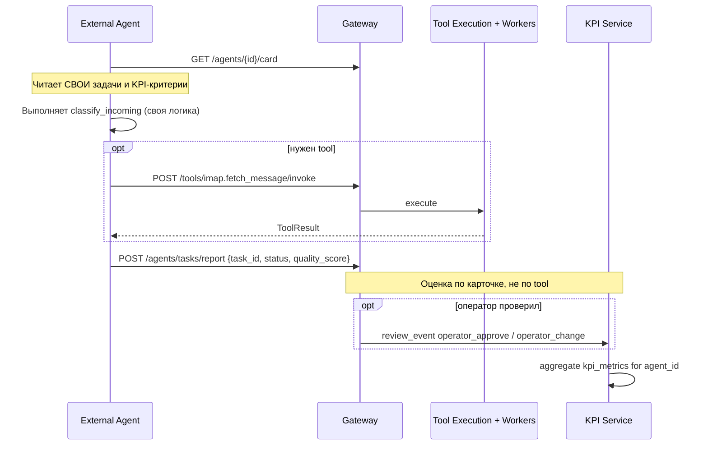

# Взаимодействие с внешним агентом

> **Карта репозитория, каталог tools, API и запуск:** [AGENT_BUILDER.md](AGENT_BUILDER.md)

Платформа Constructor — **сервер обработки** внутри контура.  
ИИ-агент — **внешний** (отдельный сервер).  
Три независимых слоя:

```
┌─────────────────────┐   ┌─────────────────────┐   ┌─────────────────────┐
│  Задачи агента      │   │  Инструментарий     │   │  KPI                │
│  (его работа)       │   │  платформы (tools)  │   │  (оценка работы)    │
│  agent_cards.tasks  │   │  tool_registry      │   │  agent_card.kpi +   │
│                     │   │                     │   │  task_reports       │
└─────────────────────┘   └─────────────────────┘   └─────────────────────┘
         ▲                          ▲                          ▲
         │                          │                          │
    Агент сообщает              Агент вызывает              Платформа считает
    что сделал                  когда нужно                 по карточке
```

**Задачи агента ≠ инструменты.**  
Агент решает сам, какие tools использовать (или не использовать). Платформа не прописывает «задача X = imap.list_unread».

---

## Три слоя

### 1. Задачи агента (бизнес-работа)

Описаны в **карточке агента** (`agent_cards.tasks_json`):

- `classify_incoming` — классифицировать документ
- `register_document` — зарегистрировать в учёте
- `route_for_review` — направить на согласование

Это **ответственность агента**, не наш pipeline tools.

Агент отчитывается: `POST /api/v1/agents/tasks/report` → `kpi.agent_task_reports`.

### 2. Инструментарий платформы (tools)

Отдельный реестр: `platform_core.tool_registry` + ACL по отделу (`TOOL_MANIFEST` / gateway).

- `imap.*`, `onec.*`, `shell.*`, `browser.*`, `fs.*`, `com.*` — **что мы умеем выполнять**
- Docker tools (:7821–7824) — в контейнерах; desktop tools (:7826–7828) — на Windows host, orchestrator ходит через `host.docker.internal`
- `shell.run` payload: `{ "command": "...", "cwd": "...", "runtime": "native"|"sandbox" }`
- Агент вызывает через `POST /api/v1/tools/{name}/invoke` **когда сам решит**
- Audit: `tools_audit.tool_events` — операционный след, не определение задач

Tool Execution (:7825) — только исполнение вызова, без привязки к бизнес-задачам.

### 3. KPI (оценка работы агента)

Считается по **карточке агента** (`kpi_metrics_json`), источники:

| source | Что измеряем |
|--------|----------------|
| `agent_task_reports` | Успешность задач, quality_score агента |
| `review_events` | Оператор принял / изменил результат |
| `tool_events` | *(опционально)* здоровье инфраструктуры, не качество работы |

Пороги `threshold_min` / `threshold_max` — из карточки, per `agent_id` и `task_id`.

---

## Граница ответственности

| Платформа (контур) | Внешний агент |
|--------------------|---------------|
| Tools, очереди, audit вызовов | Свои бизнес-задачи и planning |
| Карточка: задачи + KPI-критерии | Выполнение работы |
| Приём task report, review events | Выбор tools (или работа без tools) |
| Auth, gateway | LLM, память, диалог |

> **Tool Execution :7825** — не агент и не «задачи»; только dispatch tool-вызовов.

---

## Сценарий (pull)



---

## Mock-сценарии (`agent_mocks`)

Проверяют **инструментарий** (цепочки tool-вызовов), не задачи агента.  
Для задач агента — отдельные **task report** fixtures / E2E с карточкой.

---

## Контракты и SQL

- `platform-contracts/platform_contracts/agent_card.py`
- `infra/postgres/init/02-agent-cards.sql` — `agent_cards`, `agent_task_reports`

Инструменты: `infra/postgres/init/01-schemas.sql` → `tool_registry`.

---

## Roadmap API

| API | Назначение |
|-----|------------|
| `GET /agents/{id}/card` | Задачи + KPI-критерии |
| `POST /agents/tasks/report` | Отчёт о работе агента |
| `POST /tools/{name}/invoke` | Вызов инструмента (отдельно) |
| `GET /kpi/agents/{id}` | KPI по карточке |
