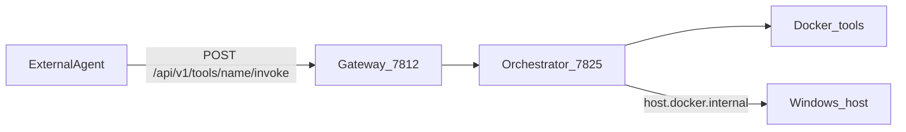

# turbobot — конструктор ИИ-агентов

> **Для агента-разработчика (карта репо, tools, API):** см. **[AGENT_BUILDER.md](AGENT_BUILDER.md)** — начните с этого файла.

Платформа из двух частей:

| Часть | Папка | Назначение |
|--------|--------|------------|
| Desktop | [`desktop/`](desktop/) | Программа для пользователя (PySide6): вход и рабочий экран |
| Backend | [`backend/`](backend/) | API: аутентификация через 1С, health, доступ к LLM/VLM |

Данные пользователей и пароли **не хранятся** в turbobot — источник истины база 1С **`erp_pm`** на SQL Server.

---

## Как это работает сейчас (MVP)

```
Пользователь
    │
    ▼
desktop (PySide6)  ──HTTP──►  backend :7812  ──ODBC──►  SQL Server erp_pm (ii1)
                                   │
                                   └── stub LLM (заготовка под реальные модели)
```

### 1. Вход

1. Пользователь вводит **ФИО** и **пароль 1С** в desktop.
2. Desktop вызывает `POST /api/v1/auth/login` на backend.
3. Backend в `erp_pm`:
   - находит пользователя в `dbo.v8users` по ФИО (`Name` / `Descr`);
   - сверяет пароль с полем `Data` (алгоритм 1С: XOR-обёртка + SHA-1);
   - подтягивает **отдел** через справочники сотрудников/подразделений  
     (`_Reference366` → `_Reference513`).
4. При успехе возвращает **JWT** и профиль `{ id, fio, department }`.
5. Desktop показывает главное окно: ФИО, отдел, статус связи с backend/ERP.

Автодополнение ФИО: `GET /api/v1/auth/users?search=...` (чтение из `v8users`).

### 2. Сессия

- JWT хранится только в памяти desktop на время работы.
- `GET /api/v1/auth/me` обновляет профиль и отдел из ERP.
- Своей БД приложения у MVP **нет** — каждый раз читаем 1С (только `SELECT`).

### 3. LLM

- `POST /api/v1/llm/chat` — заглушка (`LLM_PROVIDER=stub`).
- Нужен Bearer-токен после логина.
- Реальные LLM/VLM будут подключаться сюда же (OpenAI-совместимый контракт сообщений).

### 4. Подключение к 1С

| Параметр | Значение |
|----------|----------|
| Хост | `ii1` (внутренний DNS → `192.168.1.157`) |
| База | `erp_pm` |
| Auth | Windows Trusted Connection |
| Режим | только чтение |

**Важно:** не используйте `localhost` и не указывайте сырой IP в `ERP_SQL_SERVER`.  
По IP Windows Auth обычно падает с ошибкой 18452 — нужен hostname `ii1`.

Backend слушает **`http://127.0.0.1:7812`**. Desktop ходит на этот адрес (`BACKEND_URL`).

---

## Как это должно работать (целевая картина)

Полный цикл платформы (после MVP):

1. **Вход** — как сейчас: ФИО + пароль 1С, отдел из ERP, сессия JWT.
2. **Конструктор агента** в desktop: описание задачи, документы, настройки, визуальный/пошаговый сценарий.
3. **Backend** оркестрирует:
   - LLM (текст: план, инструкции, компиляция workflow);
   - VLM (разбор скриншотов/документов при необходимости);
   - другие модели/инструменты по мере появления.
4. Агент привязан к **отделу** пользователя (права и видимость).
5. Запуск и мониторинг агента — из desktop, исполнение — на backend/worker.

Сейчас реализованы пункты **1** и каркас **3** (stub). UI конструктора и реальные провайдеры моделей — следующие этапы.

---

## Инструменты платформы для внешнего агента

Внешний ИИ-агент вызывает инструменты через Gateway (JWT):

| Метод | Путь |
|-------|------|
| GET | `/api/v1/tools` — список разрешённых tools для отдела |
| POST | `/api/v1/tools/{name}/invoke` — выполнение tool |

Gateway проксирует вызов в Agent Runtime (orchestrator :7825), тот маршрутизирует в worker-сервисы.  
ACL по отделу: `TOOL_MANIFEST_PATH` → [`backend/data/tool_manifest.json`](backend/data/tool_manifest.json).



### Каталог tools

| Группа | Tools | Где выполняется |
|--------|-------|-----------------|
| **IMAP** | `imap.list_unread`, `imap.fetch_message`, `imap.fetch_attachments`, `imap.search` | Docker :7821 |
| **1С** | `onec.odata_get`, `onec.odata_post`, `onec.odata_patch`, `onec.attach_file`, `onec.sql_query` | Docker :7822 |
| **Browser** | `browser.open_session/close_session/navigate/snapshot/click/type/fill/wait/tabs/screenshot/extract_text` | Docker :7824 |
| **Shell sandbox** | `shell.run` с `runtime=sandbox` | Docker :7823 |
| **Shell native** | `shell.run` с `runtime=native`, опционально `cwd` | Windows host :7828 |
| **Filesystem** | `fs.list`, `fs.read`, `fs.write`, `fs.stat`, `fs.move`, `fs.copy` | Windows host :7827 |
| **COM** | `com.list_apps`, `com.connect`, `com.invoke`, `com.release`, `com.outlook.launch/close/calendar_list/calendar_get` | Windows host :7826 |

Desktop tools (COM, FS, native shell) запускаются на том же ПК:

```cmd
scripts\start_desktop_tools.cmd
```

Полный стек Docker + desktop:

```cmd
scripts\start_platform_all.cmd
```

Подробнее: **[AGENT_BUILDER.md](AGENT_BUILDER.md)** (карта репо и tools), [PLATFORM.md](PLATFORM.md), [AGENT_INTERACTION.md](AGENT_INTERACTION.md).

**Demo UI** для ручной проверки sandbox: [`platform-demo-ui/`](platform-demo-ui/), URL http://127.0.0.1:8790/

---

## Быстрый старт

### Backend

```powershell
cd c:\Users\testii\Downloads\projects_Mangasaryan\turbobot\backend
python -m pip install -e .
copy .env.example .env
python -m app.main
```

Проверка: открыть `http://127.0.0.1:7812/health` — ожидается `"status":"ok"` и `"erp_reachable":true`.

### Desktop

```powershell
cd c:\Users\testii\Downloads\projects_Mangasaryan\turbobot\desktop
python -m pip install -r requirements.txt
copy .env.example .env
python main.py
```

Нужен уже запущенный backend на порту **7812**.

### Утилиты 1С (опционально)

См. [`backend/scripts/README.md`](backend/scripts/README.md) — экспорт пользователей с отделами и проверка пароля.

---

## API (кратко)

| Метод | Путь | Назначение |
|-------|------|------------|
| GET | `/health` | Статус API и доступность ERP |
| GET | `/api/v1/auth/users?search=` | Список ФИО для автодополнения |
| POST | `/api/v1/auth/login` | Вход `{ fio, password }` → JWT + профиль |
| GET | `/api/v1/auth/me` | Текущий пользователь (Bearer) |
| POST | `/api/v1/llm/chat` | Заглушка чата (Bearer) |

Подробнее: [`backend/README.md`](backend/README.md), [`desktop/README.md`](desktop/README.md).
